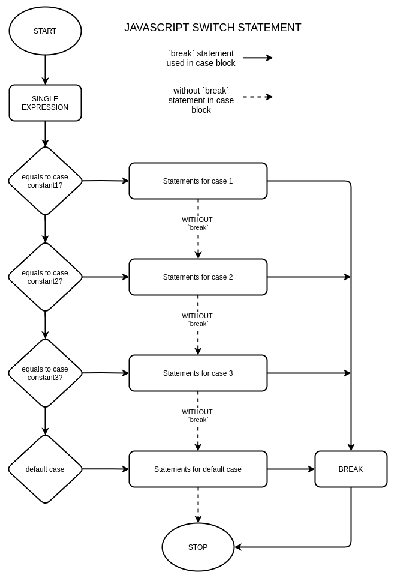

# The JavaScript Switch Statement Explained With Examples

## Introduction

In this article, we are going to learn what a Switch Statement is, we will explore the various workings of a switch statement in JavaScript, exploring exciting examples on how a switch statement can be used to control program flow. We will also compare the usage of a switch statement to that of other similar control structures such `if` statement, diffrentiating on when and how to use each. Let's get right to it; so, what is a switch statement?

In JavaScript, a switch statement is a control flow structure that's used to evaluate multiple results of a single expression. Expressions perform a piece of work in a JavaScript program, for example computing a given statement and assigning the values to a variable. Expressions in most cases always return a result, that can be stored in a variable that can be used to do other things later. In our case, a switch statement is used to perform other different actions based on the values from an expression. This is done by ensuring that a set of instructions are executed on matching one of the expected values. The expected values need to be constants within the switch statement as they are not evaluated at runtime.

### Brief overview

Switch statement provides a default, which matches any of the undefined expected results, allowing for error handling when unexpected values occur.  

A switch statement will continue evaluating the given clauses unless a `break` is explicitly introduced after executing all the instructions matching a certain clause. This ensures other expected values and their respective instructions are not executed even when they match. On the other hand, without a `break`, the switch clause is evaluated to the end.  

To actually see this practice, a switch statement would be usefull when, given an expression such as the nationality of a user, a switch statement can be used to execute seperate statments based on the user region, be it setting the national language of the given nationality for example.  

Another examples that would actually necessistate the usage of switch statement, is when given the response from a HTTP request, a switch statement can be used to perform different actions based on the response status code.  

## Syntax of a Switch Statement

```javascript
switch (expression) {
    case result_1: // value_1 is a constant
        // Statements here are executed when result of expression matches value of result_1
        [break;] // OPTIONAL break to break from switch clause once this claues matches.

    case result_2:
        // Statements executed when expression returns value that matches result_2
        [break;]

    ... // Other clauses

    case result_n;
        [break;]

    [default:
        // Statements here are excuted when none of the other clauses match expression result.
        // The default clause can be placed at any position within the switch statement
        // This is an optional case, but it's good practice to always have a default clause.
        [break;]]    
}
```

### Example

```javascript
switch(age){
    case 1: console.log("You're one."); break;
    case 2: console.log("You're two."); break;
    case 3: console.log("You're three.");
    case 4: console.log("You're are three or four."); break;
    default: console.log("You're definately over four.");
}
```

Once control of a program enters a switch statement, the `expression` is first executed, then followed by matching the first case constant to the value of the expression result, in the case they match, the statements in that clause are executed.

In a scenario that they do not match, control of program goes on to compare the expression's result to the second clause, evaluating it's statements when there is a match.

Once the statements of a given case clause are executed, where a `break` statement is used, this ends the switch case and program control is returned to main program. Since `break` statements are optional, when they are not available, the program will continue matching other case clauses that follow irrespective they matched the case. This introduces some very unique usage for a switch statement.

In a scenario where non of the clause match, the `default` clause if available is executed, calling all the statements for the default clause and then exiting the switch statement. When a `default` clause is not available, no statements within any of the switch cases would be excuted and the program would most likely crash.  

## Flow Diagram



As shown above, the program start by executing the given expression, then comparing the returned value with the given case constants. When the case constant match the returned value, the program goes ahead to execute the statements for the matching case. When `break` statements are provided, the program exits the switch statement immediately, otherwise it would go on evaluating statements in other cases even when case constants do not match, until it exits or another `break` statement is encountered.

## How Switch Statement Works in Javascript

### Expression

In JavaScript, expression are blocks of code that perform work, and assign the values to variables.  Ideally expressions evaluate to a value, meaning that the given expression must return a value. This is the value to be compared to the constant defined in each case clause in a swich statement. Switch statements evaluate a given expression only once.

An example of an expression in JavaScript,

```javascript
// simple expression
> 1 + 1
< 2

// another expression
> "+" + 254700111222
< '+254700111222' 

// expression with result assigned to a variable
> name_prefix = "Ms. "
> full_name = name_prefix + "Jane Doe`"
< 'Ms. Jane Doe'
> console.log(full_name)
    Ms. Jane Doe

```
> _This examples were carried out the Inspect tool console on Chrome Web._

... in the example above, each `>` entry is an expression, such as `1 + 1` which evaluates to `2`, one thing to notice with our expressions above, they all return a value. This value can also be assigned to a variable that can be used for other purposes, as seen in the last example above. 


### Cases

Cases define blocks of instructions for the program to execute once a given result for an expression matches the case constant. The are used to control program flow within a switch statement, separating pieces of work a program should perform once a case is matched.

In Javascript, the comparision of results is strict `===`, meaning values being compared must be of the same type as well as the same value.

To retain changes made while executing a switch statement, variables are set outside of the switch block, and their values can be altered when executing a switch statement.

Variables can also be scoped within the case blocks of a given clause by using `let` and `const`, to ensure they are only available within the execution instructions of that case only.

One outsanding feature of cases, is the different outcomes based on the provision of `break` statement at the end of the case blocks. When provided, the excution within the switch block ends, otherwise, other case clause's statements are evaluated.

### Default Case

The default case is optional and can be defined in whichever position within the switch block, its evaluated when all the other cases do no match the value of given expression. A `break` statement is not necessary in this case as the execution of the switch statement ends here anyway.

## Examples of Switch Statements

Example to print name of the Day fetched from the day of week of the the current date time. This can be used to modify the result of the expected day name say _'Monday'_ to something funky as _'Money Day'_.

```javascript
const today = new Date(Date.now())
switch (today.getDay()) {
    case 0: 
        console.log("Today is Sunday");
        break;
    case 1:
        console.log("Today is Monday");
        break;
    case 2:
        console.log("Today is Tuesday");
        break;
    case 3:
        console.log("Today is WednesDay");
        break;
    case 4: 
        console.log("Today is Thursday");
        break;
    case 5: 
        console.log("Today is Friday");
        break;
    case 6:
        console.log("Today is Saturday");
        break;
    default:
        console.log("Not a day of the week.");
}
```

First a constant is defined with epoch time in Javascript Date format. The expression evaluates the day of week with `Date.protocal.getDay()` of the constant date variable, which returns an integer representing days of the week, ie. 0-6 to Sunday to Saturday respectively.

The returned value is compared with the given result, return a modified name of the day of the week of epoch time.

## Executing Multiple Cases if Condition Satisfies

Considering that `break` statements are optional, multiple cases can be evaluated within the same switch block. When no `break` statement is provided, the program will continue to execute other case's statement block until a `break` statement is encountered.

Example, lets use a switch statement to find when epoch time was either a weekday or weekend.

```javascript
const today = new Date(Date.now())
switch (today.getDay()) {
    case 1:
    case 2:
    case 3:
    case 4:
    case 5:
        console.log("Today is a weekday");
        break;
    case 6:
    case 0:
        console.log("Today is a weekend");
        break;
    default:
        console.log("Invalid day of the week")
}
```

In the above example, `break` statement having been omitted for the case blocks of the first 5 case clauses, ensures that once any of the case constant matches a given value, its code block will be executed, but since there are no defined statements, it goes on to execute other case clauses until encountering a `break` system, that exits the program from execution.

## Switch Statement vs If Else Statement

`if else` statements is a conditional control structure that is used to compare against a pair of outcomes. This can only be either `true` or `false` responses only, though they are used to compare boolean values, if else statements can be used instead of switch statements especially when the expected results from an expression are either `true` or `fasle`, since this are the constants required to evaluate the different cases in an if statement execution. Switch statements have better support for handling multilple result not restricted to only `true` or `fasle`.

Even though it's possible to achieve similar control flow with `if else` statements, `switch case` offers more readablity of the code, as nested if conditions are not always quick to read through and understand flow of a program.  

An Example above written with if statements.

```javascript
let today = new Date(Date.now())
var day = today.getDay()
if (day === 0) { 
    console.log("[IF] Epoch was on a weekend")
} else if (day <= 5){
    console.log("[IF ELSE] Epoch was on a weekeday")
} else  if (day === 6){
    console.log("[IF ELSE] Epoch was on a weekend")
} else {
    console.log("[ELSE] Invalid day of the week")
}
```

## When to use Switch Statement

Switch statements, as we have explored in the examples, is better suited for multiple cases of an expected result. While an if else statement would be better for cases with only 2 conditions.

## Wrap up

<p class="codepen" data-height="265" data-theme-id="light" data-default-tab="js,result" data-user="Mamboleoo" data-slug-hash="XWJPxpZ" style="height: 265px; box-sizing: border-box; display: flex; align-items: center; justify-content: center; border: 2px solid; margin: 1em 0; padding: 1em;" data-pen-title="Walkers - How to">
  <span>See the Pen <a href="https://codepen.io/Mamboleoo/pen/XWJPxpZ">
  Walkers - How to</a> by Louis Hoebregts (<a href="https://codepen.io/Mamboleoo">@Mamboleoo</a>)
  on <a href="https://codepen.io">CodePen</a>.</span>
</p>
<script async src="https://static.codepen.io/assets/embed/ei.js"></script>