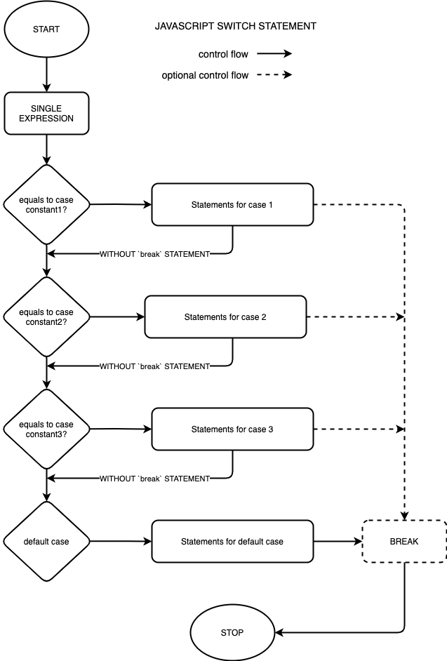

# The Javascript Switch Statement Explained With Examples

## Introduction

In javascript a switch statement, is a control flow structure that's used to evaluate multiple results of a single expression ensuring that the instructions are executed on matching one of the expected values. The expected values need to be constants within the switch statement as they are not evaluated at runtime.  

Switch statement also provides a default, which matches any of the undefined expected results, allowing for error handling when unexpected values occur.  

A switch statement will continue evaluating the given clauses unless a `break` is explicitly introduced after executing all the instructions matching a certain clause. This ensures other expected values and their respective instructions are not executed even when they match. On the other hand, without a `break`, the switch clause is evaluated to the end.  

To actually see this practice, a switch statement would be usefull when, given an expression such as the nationality of a user, a switch statement can be used to execute seperate statments based on the user region, be it setting the national language of the given nationality for example.  

Another examples that would actually necessistate the usage of switch statement, is when given the response from a HTTP request, a switch statement can be used to perform different actions based on the response status code.  

## Syntax of a Switch Statement
```javascript
switch (expression) {
    case result_1: // value_1 is a constant
        // Statements here are executed when result of expression matches value of result_1
        [break;] // OPTIONAL break to break from switch clause once this claues matches.

    case result_2:
        // Statements executed when expression returns value that matches result_2
        [break;]

    ... // Other clauses

    case result_n;
        [break;]

    [default:
        // Statements here are excuted when none of the other clauses match expression result.
        // The default clause can be placed at any position within the switch statement
        // This is an optional case, but it's good practice to always have a default clause.
        [break;]]    
}
```

Once control of a program enters a switch statement, the `expression` is first executed, then followed by matching the first case constant to the value of the expression result, in the case they match, the statements in that clause are executed.  
In a scenario that they do not match, control of program goes on to compare the expression's result to the second clause, evaluating it's statements when there is a match.
Once the statements of a given case clause are executed, where a `break` statement is used, this ends the switch case and program control is returned to main program. Since `break` statements are optional, when they are not available, the program will continue matching other case clauses that flow irrespective they matched the case without a break statement. This introduces some very unique usage for a switch statement.    
In a scenario where non of the clause match, the `default` clause if available is executed, calling all the statements for the default clause and then exiting the switch statement. When a `default` clause is not available, no statements within any of the switch cases would be excuted.  

## Flow Diagram



As shown above, the program start by executing the given expression, then checking the results match/equal to the given case constant, in which case it would go ahead to execute the statements for the matching case. When `break` statements are provided, the program exits the switch statement immediately, otherwise continues evaluating other cases.  